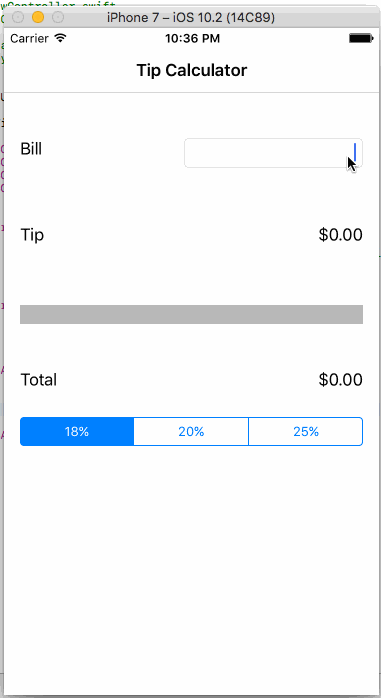

# Pre-work - TipCalculatorProper

TipCalculatorProper is a tip calculator application for iOS.

Submitted by: Poojan Dave

Time spent: 6 hours spent in total

## User Stories

The following **required** functionality is complete:

* [x] User can enter a bill amount, choose a tip percentage, and see the tip and total values.
* [ ] Settings page to change the default tip percentage.

The following **optional** features are implemented:
* [ ] UI animations
* [ ] Remembering the bill amount across app restarts (if <10mins)
* [ ] Using locale-specific currency and currency thousands separators.
* [ ] Making sure the keyboard is always visible and the bill amount is always the first responder. This way the user doesn't have to tap anywhere to use this app. Just launch the app and start typing.

The following **additional** features are implemented:

- [ ] List anything else that you can get done to improve the app functionality!

## Video Walkthrough 

Here's a walkthrough of implemented user stories:

GIF created with [LiceCap](http://www.cockos.com/licecap/).

## Notes

Describe any challenges encountered while building the app.

I was not aware that there was a video tutorial with help on how to create a tip calculator. I made one myself at first, which was a challenge, but I learned a lot. 
I also had issues since the video is pretty recent but still somewhat outdated. However, I was able to solve those situations by looking online for solutions. Since I was not too familiar with the syntax in swift, I had to learn it first. So, I learned the major concepts of Swift such as Optionals and general syntax.
This was a very fun project. I feel like I am going to learn a lot.

## License

    Copyright [2017] [Poojan Dave]

    Licensed under the Apache License, Version 2.0 (the "License");
    you may not use this file except in compliance with the License.
    You may obtain a copy of the License at

        http://www.apache.org/licenses/LICENSE-2.0

    Unless required by applicable law or agreed to in writing, software
    distributed under the License is distributed on an "AS IS" BASIS,
    WITHOUT WARRANTIES OR CONDITIONS OF ANY KIND, either express or implied.
    See the License for the specific language governing permissions and
    limitations under the License.
